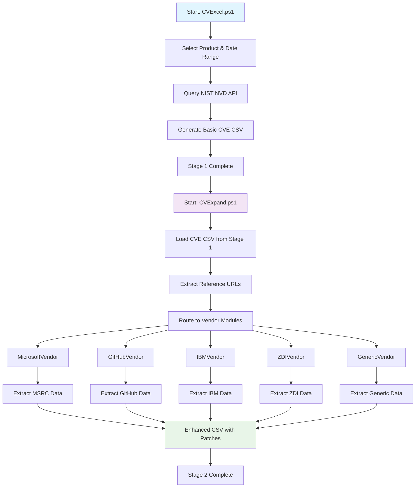

# CVExcel - Two-Stage CVE Data Collection & Enrichment System

[](#ai-foreman)

**Stage 1: Collect CVE data from NIST • Stage 2: Enrich with vendor patch information**

[](https://github.com/PowerShell/PowerShell)
[](LICENSE)
[](https://github.com/your-username/CVExcel)

---

## 🚀 Quick Start

### Prerequisites
- **PowerShell 7.x** or higher
- **Windows 10/11** or Windows Server 2016+
- **Internet connection** for API access

### Installation

1. **Clone or download this repository**

2. **Install the Microsoft Security Updates API module** (required for MSRC data):
   ```powershell
   Install-Module -Name MsrcSecurityUpdates -Scope CurrentUser -Force
   ```

3. **Optional: Install Playwright** for JavaScript-heavy sites:
   ```powershell
   .\Install-Playwright.ps1
   ```

### Usage

**Complete Workflow** (Two-Stage Process):

1. **Stage 1: Collect CVE Data from NIST**
   ```powershell
   .\CVExcel.ps1
   ```
   - Select product and date range
   - Downloads CVE data from NIST NVD API
   - Outputs basic CSV with CVE information

2. **Stage 2: Enrich with Vendor Data**
   ```powershell
   .\CVExpand.ps1
   # OR for GUI mode:
   .\ui\CVExpand-GUI.ps1
   ```
   - Load CSV from Stage 1
   - Scrapes vendor websites for patch information
   - Outputs enhanced CSV with download links and patches

---

## 🔄 Two-Stage Workflow



---

## 📋 What It Does

CVExcel provides a comprehensive two-stage CVE data collection and enrichment system:

### Stage 1: NIST CVE Collection (CVExcel.ps1)
- 📊 **NIST NVD API Integration** - Official vulnerability database access
- 🎯 **Product-Based Filtering** - Search by keywords or CPE identifiers
- 📅 **Date Range Support** - Filter by publication or modification dates
- 🔑 **API Key Support** - Higher rate limits with NVD API key
- 📋 **Basic CVE Data** - CVSS scores, descriptions, reference URLs

### Stage 2: Vendor Data Enrichment (CVExpand.ps1)
- 🔗 **Vendor-Specific Scraping** - Extracts patch information from vendor websites
- ✅ **Microsoft MSRC** - KB articles and download links
- ✅ **GitHub Security Advisories** - Repository security updates
- ✅ **IBM Security Bulletins** - IBM patch information
- ✅ **Zero Day Initiative (ZDI)** - Vulnerability disclosures
- ✅ **Generic Vendors** - Extensible system for any vendor

### Key Features
- 🎯 **Automatic Patch Extraction** - Gets download links and KB articles
- 🔄 **Modular Architecture** - Vendor-specific handlers for optimal extraction
- 🖥️ **Dual Interface** - GUI and command-line modes
- 📝 **Comprehensive Logging** - Detailed operation logs
- 🔒 **NIST Security Compliant** - Follows security best practices
- 🚀 **Playwright Integration** - Handles JavaScript-heavy pages

---

## 📊 Output Format

### Stage 1 Output (CVExcel.ps1)
Basic CVE data from NIST NVD:

| Field | Description |
|-------|-------------|
| **CVE** | CVE identifier (e.g., CVE-2024-21302) |
| **Published** | Publication date |
| **LastModified** | Last modification date |
| **CVSS_BaseScore** | CVSS severity score |
| **Severity** | Severity rating (Critical/High/Medium/Low) |
| **Summary** | Vulnerability description |
| **RefUrls** | Reference URLs from NIST |
| **Vendor/Product/Version** | Affected software information |

### Stage 2 Output (CVExpand.ps1)
Enhanced with vendor-specific data:

| Field | Description |
|-------|-------------|
| **DownloadLinks** | Direct links to KB articles, patches, and security updates |
| **PatchID** | KB article numbers or patch identifiers |
| **AffectedVersions** | List of affected software versions |
| **Remediation** | Remediation steps and guidance |
| **ScrapeStatus** | Success/failure status |
| **ScrapedDate** | Timestamp of data extraction |

---

## 🏗️ Project Structure

```
CVExcel/
├── CVExcel.ps1                 # Stage 1: NIST CVE Collection
├── CVExpand.ps1                # Stage 2: Vendor Data Enrichment
├── Install-Playwright.ps1      # Playwright setup
├── README.md                   # This file
│
├── ui/                         # GUI modules
│   ├── CVExpand-GUI.ps1       # Stage 2 GUI application
│   ├── DependencyManager.ps1  # Dependency manager
│   ├── ScrapingEngine.ps1     # Scraping engine
│   └── PlaywrightWrapper.ps1  # Playwright wrapper
│
├── vendors/                    # Vendor-specific modules
│   ├── BaseVendor.ps1         # Base vendor class
│   ├── MicrosoftVendor.ps1    # Microsoft MSRC scraper
│   ├── GitHubVendor.ps1       # GitHub Security scraper
│   ├── IBMVendor.ps1          # IBM Security scraper
│   ├── ZDIVendor.ps1          # Zero Day Initiative scraper
│   ├── GenericVendor.ps1      # Generic fallback scraper
│   └── VendorManager.ps1      # Vendor coordinator
│
├── tests/                      # Test scripts
├── docs/                       # Documentation
├── out/                        # Output directory (CSV files)
└── config/                     # Configuration files
```

---

## 📚 Documentation

**📖 [Complete Documentation Index](docs/INDEX.md)**

### Essential Guides
- **[Quick Start Guide](docs/QUICK_START.md)** - Get up and running
- **[MSRC API Solution](docs/MSRC_API_SOLUTION.md)** ⭐ **RECOMMENDED** - Microsoft CVE extraction
- **[Vendor Module Guide](docs/VENDOR_MODULARIZATION_SUMMARY.md)** - Adding custom vendors
- **[Deployment Guide](docs/DEPLOYMENT_GUIDE.md)** - Production deployment

### Technical Documentation
- **[API Reference](docs/API_REFERENCE.md)** - Function reference
- **[Project Overview](docs/PROJECT_OVERVIEW.md)** - Architecture overview
- **[Implementation Details](docs/IMPLEMENTATION_COMPLETE_CVEXPAND_GUI.md)** - Technical details

---

## 🎯 Key Features

### Stage 1: NIST NVD API Integration ⭐

**Official NIST NVD API v2.0** for reliable, comprehensive CVE data collection.

**Benefits:**
- ✅ Official NIST vulnerability database access
- ✅ Comprehensive CVE metadata (CVSS, descriptions, references)
- ✅ Product-based filtering with CPE support
- ✅ Rate limiting compliance (5-50 requests/30sec)
- ✅ Automatic CPE resolution for keyword searches

**Example Stage 1 Output:**
```text
CVE-2024-21302, Critical, Remote Code Execution,
Published: 2024-01-09, CVSS: 9.8
Summary: Microsoft Remote Desktop Services Remote Code Execution Vulnerability
RefUrls: https://msrc.microsoft.com/update-guide/vulnerability/CVE-2024-21302
```

### Stage 2: Vendor Data Enrichment

**Multi-vendor scraping system** with Playwright integration for JavaScript-heavy pages.

**Benefits:**
- ✅ Microsoft MSRC patch extraction
- ✅ GitHub security advisory processing
- ✅ IBM security bulletin parsing
- ✅ Zero Day Initiative integration
- ✅ Extensible vendor module system

**Example Stage 2 Enhancement:**
```text
CVE-2024-21302 → Enhanced with:
  KB Articles: KB5062557, KB5055526, KB5055518...
  Download Links: 18 links
    • https://catalog.update.microsoft.com/v7/site/Search.aspx?q=KB5062557
    • https://support.microsoft.com/help/5062557
    ... (16 more)
  AffectedVersions: Windows 10, Windows 11, Windows Server 2016+
```

### Modular Vendor Architecture

Extensible vendor-specific extraction modules:
- **BaseVendor** - Common interface and shared functionality
- **MicrosoftVendor** - MSRC API integration and page scraping
- **GitHubVendor** - GitHub API and repository scraping
- **IBMVendor** - IBM security bulletin parsing
- **ZDIVendor** - Zero Day Initiative advisory processing
- **GenericVendor** - Fallback for unknown vendor sites

**Extensible Design** - See [Vendor Module Guide](docs/VENDOR_MODULARIZATION_SUMMARY.md) to add new vendors

---

## 🛠️ Requirements

### System Requirements
- **OS:** Windows 10/11, Windows Server 2016+
- **PowerShell:** Version 7.x or higher
- **Memory:** 2GB RAM minimum
- **Disk:** 500MB free space

### PowerShell Modules
- **MsrcSecurityUpdates** (required for Microsoft CVEs)
  ```powershell
  Install-Module -Name MsrcSecurityUpdates -Scope CurrentUser
  ```

- **Playwright** (optional, for JavaScript-heavy sites)
  ```powershell
  .\Install-Playwright.ps1
  ```

---

## 📖 Examples

### Example 1: Complete Two-Stage Workflow
```powershell
# Stage 1: Collect CVE data from NIST

[](#ai-foreman)
.\CVExcel.ps1
# Select product: "microsoft windows"

[](#ai-foreman)
# Select date range: Last 30 days

[](#ai-foreman)
# Output: microsoft_windows_20251004_155424.csv

[](#ai-foreman)

# Stage 2: Enrich with vendor data

[](#ai-foreman)
.\ui\CVExpand-GUI.ps1
# Load the CSV from Stage 1

[](#ai-foreman)
# Click "Start Scraping"

[](#ai-foreman)
# Output: Enhanced CSV with download links and patches

[](#ai-foreman)
```

### Example 2: Command Line Processing
```powershell
# Stage 1: NIST data collection

[](#ai-foreman)
.\CVExcel.ps1  # Use GUI to select product and dates

# Stage 2: Vendor enrichment

[](#ai-foreman)
.\CVExpand.ps1 -Url "https://msrc.microsoft.com/update-guide/vulnerability/CVE-2024-21302"

# Check the results

[](#ai-foreman)
Import-Csv ".\out\microsoft_windows_enhanced.csv" | Select-Object CVE, DownloadLinks
```

### Example 3: Direct NIST API Usage
```powershell
# Test NIST API connectivity

[](#ai-foreman)
.\CVExcel.ps1  # Click "Test API" button in GUI

# Or use PowerShell modules directly

[](#ai-foreman)
Import-Module MsrcSecurityUpdates
$update = Get-MsrcSecurityUpdate -Vulnerability CVE-2024-21302
$cvrf = Get-MsrcCvrfDocument -ID $update.value[0].ID
$cvrf.Vulnerability | Where-Object {$_.CVE -eq 'CVE-2024-21302'} |
    Select-Object -ExpandProperty Remediations |
    Where-Object {$_.URL -match 'catalog.update.microsoft.com'}
```

---

## 🤝 Contributing

Contributions are welcome! Please:

1. Check existing documentation and issues
2. Follow PowerShell best practices
3. Include tests for new features
4. Update documentation as needed

See [docs/](docs/) for coding standards and architecture.

---

## 🔒 Security

This project follows NIST security guidelines. See the [Security Policy](SECURITY.md) for details.

**Security Features:**
- Input validation on all user-provided data
- Secure API authentication
- Comprehensive logging for audit trails
- Rate limiting and retry logic
- Error handling without information disclosure

---

## 📝 License

This project is licensed under the MIT License - see the [LICENSE](LICENSE) file for details.

---

## 🙏 Acknowledgments

- **Microsoft Security Response Center** - For the official Security Updates API
- **PowerShell Community** - For excellent modules and support
- **Security Researchers** - For CVE data and advisories

---

## 📞 Support

### Documentation
- **[Documentation Index](docs/INDEX.md)** - Complete documentation
- **[Quick Start](docs/QUICK_START.md)** - Get started quickly
- **[FAQ](docs/README.md)** - Frequently asked questions

### Issues
- Check [existing documentation](docs/INDEX.md) first
- Review [archived docs](docs/archive/) for historical context
- Create an issue if needed with:
  - Clear description
  - Steps to reproduce
  - Expected vs actual behavior
  - Log files (from `out/scrape_log_*.log`)

---

## 🔄 Version History

### Latest (October 2025)
- ✨ **NEW:** Two-stage CVE collection and enrichment system
- ✨ **NEW:** NIST NVD API v2.0 integration for Stage 1
- ✨ **NEW:** Modular vendor architecture for Stage 2
- ✨ **NEW:** Playwright integration for JavaScript-heavy pages
- ✨ **NEW:** CVExpand-GUI with enhanced batch processing
- 🐛 Fixed MSRC page scraping issues
- 📚 Comprehensive documentation and README overhaul

### Previous Versions
See [docs/archive/](docs/archive/) for historical documentation.

---

## 🌟 Star History

If you find this tool useful, please consider giving it a star! ⭐

---

**Built with ❤️ and PowerShell**


