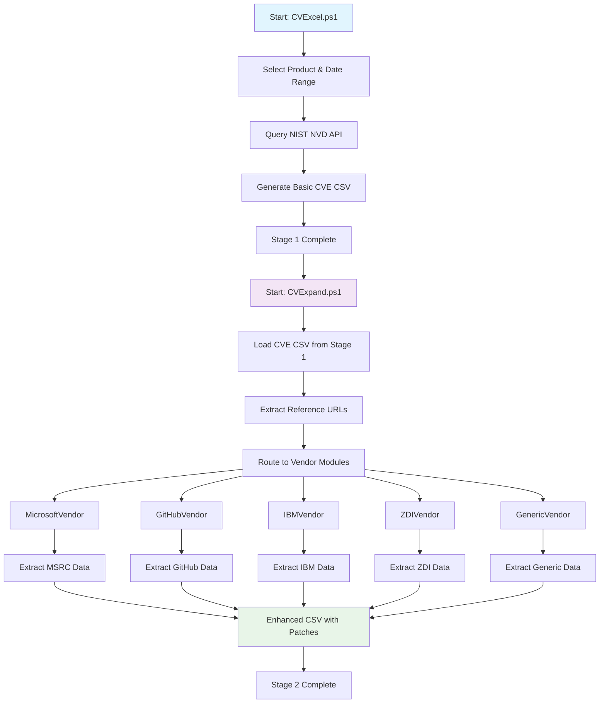

# CVExcel - Two-Stage CVE Data Collection & Enrichment System


[](#ai-foreman)

**Stage 1: Collect CVE data from NIST • Stage 2: Enrich with vendor patch information**

[](https://github.com/PowerShell/PowerShell)
[](LICENSE)
[](https://github.com/your-username/CVExcel)

---

## 🤖 AI Foreman Integration

CVExcel includes **AI Foreman** - an automated code maintenance system that:

- 🔍 **Automated Analysis** - Continuously analyzes code quality and security compliance
- 🛠️ **Idempotent Development** - Ensures consistent, repeatable results through Cursor chat integration
- 🔒 **NIST Security Compliance** - Automatically enforces NIST SP 800-53 security guidelines
- 🧪 **Automated Testing** - All changes are tested before application
- 📝 **Comprehensive Logging** - Maintains detailed audit trails

### Quick Start with AI Foreman

```powershell
# Submit a request through Cursor chat integration
.\cursor-chat-integration.ps1 -Type "add_feature" -Description "Add support for Oracle security advisories"

# Run AI Foreman manually
.\ai-foreman.ps1 -VerboseLog

# Check AI Foreman status
Get-Content .ai\state\fp.json | ConvertFrom-Json
```

**📖 [Complete AI Foreman Integration Guide](docs/AI_FOREMAN_INTEGRATION.md)**

### Spec Kit

This project includes a comprehensive **Spec Kit** (`spec-kit.yaml`) that defines:

- **Architecture** - Two-stage CVE data collection pipeline
- **Tech Stack** - PowerShell 7.x, Playwright, Pester, PSScriptAnalyzer
- **Code Standards** - PowerShell best practices and NIST security compliance
- **Vendor Modules** - Interface specifications and requirements
- **Testing Requirements** - Pester framework with 80% coverage target
- **Documentation Standards** - XML comments and comprehensive docs
- **AI Foreman Integration** - Automated code maintenance workflow

The Spec Kit serves as the single source of truth for project specifications, standards, and requirements.

**📋 [View Spec Kit](spec-kit.yaml)**

## 🚀 Quick Start

### Prerequisites

**Required:**
- **PowerShell 7.x** or higher (check with `$PSVersionTable.PSVersion`)
- **Windows 10/11** or Windows Server 2016+
- **Internet connection** for API access and web scraping
- **Administrator privileges** (for Playwright installation)

**Optional but Recommended:**
- **NIST NVD API Key** (get free key at [https://nvd.nist.gov/developers/request-an-api-key](https://nvd.nist.gov/developers/request-an-api-key))
  - Without API key: 5 requests per 30 seconds
  - With API key: 50 requests per 30 seconds (10x faster)

### Installation Steps

1. **Clone or download this repository**
   ```powershell
   # Navigate to project directory
   cd CVExcel
   ```

2. **Set PowerShell execution policy** (required for script execution)
   ```powershell
   Set-ExecutionPolicy -ExecutionPolicy RemoteSigned -Scope CurrentUser
   ```

3. **Install required PowerShell modules**
   ```powershell
   # Install Microsoft Security Updates API module (required for MSRC data)
   Install-Module -Name MsrcSecurityUpdates -Scope CurrentUser -Force

   # Verify installation
   Get-Module -ListAvailable MsrcSecurityUpdates
   ```

4. **Optional: Install Playwright** (for JavaScript-heavy vendor sites)
   ```powershell
   .\Install-Playwright.ps1
   ```

5. **Optional: Add NVD API Key** for faster data collection
   ```powershell
   # Create API key file
   "your-api-key-here" | Out-File -FilePath nvd.api.key -NoNewline

   # OR set environment variable
   $env:NVD_API_KEY = "your-api-key-here"
   ```

### Running the Scripts

**Two-Stage Workflow:**

#### Stage 1: Collect CVE Data from NIST

```powershell
.\CVExcel.ps1
```

**Interactive GUI Steps:**
1. Select product from dropdown (or type custom keyword)
2. Choose date range (Start Date and End Date in UTC)
3. Select search method:
   - ✅ **Use last-modified dates** - Searches by when CVE was last modified
   - ✅ **Validate product only (no dates)** - Tests product search without date filtering
4. Click "Query NVD API" button
5. Wait for data collection (progress shown in GUI)
6. Review results and click "Export CSV"

**Expected Output:** CSV file saved to `out\` directory, e.g., `microsoft_windows_20251026_172736.csv`

**Sample CSV Output (Stage 1):**
```csv
ProductFilter,CVE,Published,LastModified,CVSS_BaseScore,Severity,Summary,RefUrls,Vendor,Product,Version,CPE23Uri
microsoft windows,CVE-2024-21302,1/9/2024,1/18/2024,9.8,Critical,Microsoft Remote Desktop Services Remote Code Execution,"https://msrc.microsoft.com/update-guide/vulnerability/CVE-2024-21302","microsoft","windows_2022","-","cpe:2.3:o:microsoft:windows_server_2022:-:*:*:*:*:*:*:*"
```

#### Stage 2: Enrich with Vendor Data

**Option A: GUI Mode (Recommended for beginners)**
```powershell
.\ui\CVExpand-GUI.ps1
```

**GUI Steps:**
1. Click "Load CSV" and select the Stage 1 output file
2. Review the loaded CVE list
3. Click "Start Scraping" to enrich with vendor data
4. Monitor progress in the status window
5. Click "Export Enhanced CSV" when complete

**Option B: Command Line Mode (For automation)**
```powershell
# Single URL processing
.\CVExpand.ps1 -Url "https://msrc.microsoft.com/update-guide/vulnerability/CVE-2024-21302"

# Batch processing from CSV
$csv = Import-Csv "out\microsoft_windows_20251026_172736.csv"
$csv | ForEach-Object {
    .\CVExpand.ps1 -Url $_.RefUrls.Split('|')[0]
} | Export-Csv "out\microsoft_windows_enhanced.csv" -NoTypeInformation
```

**Expected Output:** Enhanced CSV file with additional columns:
- `DownloadLinks` - Direct links to KB articles, patches, and security updates
- `PatchID` - KB article numbers or patch identifiers
- `AffectedVersions` - List of affected software versions
- `Remediation` - Remediation steps and guidance
- `ScrapeStatus` - Success/failure status
- `ScrapedDate` - Timestamp of data extraction

**Sample Enhanced CSV Output (Stage 2):**
```csv
CVE,DownloadLinks,PatchID,AffectedVersions,ScrapeStatus
CVE-2024-21302,"https://catalog.update.microsoft.com/v7/site/Search.aspx?q=KB5034129 | https://support.microsoft.com/help/5034129 | ...","KB5034129,KB5034119,KB5034115","Windows 11 Version 24H2, Windows Server 2022, ...","Success"
```

---

## 🔄 Two-Stage Workflow



---

## 📋 What It Does

CVExcel provides a comprehensive two-stage CVE data collection and enrichment system:

### Stage 1: NIST CVE Collection (CVExcel.ps1)
- 📊 **NIST NVD API Integration** - Official vulnerability database access
- 🎯 **Product-Based Filtering** - Search by keywords or CPE identifiers
- 📅 **Date Range Support** - Filter by publication or modification dates
- 🔑 **API Key Support** - Higher rate limits with NVD API key
- 📋 **Basic CVE Data** - CVSS scores, descriptions, reference URLs

### Stage 2: Vendor Data Enrichment (CVExpand.ps1)
- 🔗 **Vendor-Specific Scraping** - Extracts patch information from vendor websites
- ✅ **Microsoft MSRC** - KB articles and download links
- ✅ **GitHub Security Advisories** - Repository security updates
- ✅ **IBM Security Bulletins** - IBM patch information
- ✅ **Zero Day Initiative (ZDI)** - Vulnerability disclosures
- ✅ **Generic Vendors** - Extensible system for any vendor

### Key Features
- 🎯 **Automatic Patch Extraction** - Gets download links and KB articles
- 🔄 **Modular Architecture** - Vendor-specific handlers for optimal extraction
- 🖥️ **Dual Interface** - GUI and command-line modes
- 📝 **Comprehensive Logging** - Detailed operation logs
- 🔒 **NIST Security Compliant** - Follows security best practices
- 🚀 **Playwright Integration** - Handles JavaScript-heavy pages

---

## 📊 Output Format

### Stage 1 Output (CVExcel.ps1)
Basic CVE data from NIST NVD:

| Field | Description |
|-------|-------------|
| **CVE** | CVE identifier (e.g., CVE-2024-21302) |
| **Published** | Publication date |
| **LastModified** | Last modification date |
| **CVSS_BaseScore** | CVSS severity score |
| **Severity** | Severity rating (Critical/High/Medium/Low) |
| **Summary** | Vulnerability description |
| **RefUrls** | Reference URLs from NIST |
| **Vendor/Product/Version** | Affected software information |

### Stage 2 Output (CVExpand.ps1)
Enhanced with vendor-specific data:

| Field | Description |
|-------|-------------|
| **DownloadLinks** | Direct links to KB articles, patches, and security updates |
| **PatchID** | KB article numbers or patch identifiers |
| **AffectedVersions** | List of affected software versions |
| **Remediation** | Remediation steps and guidance |
| **ScrapeStatus** | Success/failure status |
| **ScrapedDate** | Timestamp of data extraction |

---

## 🏗️ Project Structure

```
CVExcel/
├── CVExcel.ps1                 # Stage 1: NIST CVE Collection
├── CVExpand.ps1                # Stage 2: Vendor Data Enrichment
├── ai-foreman.ps1              # AI Foreman automation
├── cursor-chat-integration.ps1 # Cursor chat integration
├── Install-Playwright.ps1      # Playwright setup
├── README.md                   # This file
│
├── .ai/                        # AI Foreman configuration
│   ├── spec-pack.yaml         # Spec Kit configuration
│   ├── rules.yaml             # AI Foreman rules
│   ├── checks/                # Analysis scripts
│   ├── planners/              # Planning scripts
│   └── state/                 # State and results
│
├── ui/                         # GUI modules
│   ├── CVExpand-GUI.ps1       # Stage 2 GUI application
│   ├── DependencyManager.ps1  # Dependency manager
│   ├── ScrapingEngine.ps1     # Scraping engine
│   └── PlaywrightWrapper.ps1  # Playwright wrapper
│
├── vendors/                    # Vendor-specific modules
│   ├── BaseVendor.ps1         # Base vendor class
│   ├── MicrosoftVendor.ps1    # Microsoft MSRC scraper
│   ├── GitHubVendor.ps1       # GitHub Security scraper
│   ├── IBMVendor.ps1          # IBM Security scraper
│   ├── ZDIVendor.ps1          # Zero Day Initiative scraper
│   ├── GenericVendor.ps1      # Generic fallback scraper
│   └── VendorManager.ps1      # Vendor coordinator
│
├── tests/                      # Test scripts
├── docs/                       # Documentation
├── out/                        # Output directory (CSV files)
├── config/                     # Configuration files
├── .cursorrules                # Cursor workspace rules
└── cursor-workspace.json       # Cursor workspace configuration
```

---

## 📚 Documentation

**📖 [Complete Documentation Index](docs/INDEX.md)**

### Essential Guides
- **[Quick Start Guide](docs/QUICK_START.md)** - Get up and running
- **[AI Foreman Integration](docs/AI_FOREMAN_INTEGRATION.md)** ⭐ **NEW** - Automated code maintenance with Cursor chat
- **[MSRC API Solution](docs/MSRC_API_SOLUTION.md)** ⭐ **RECOMMENDED** - Microsoft CVE extraction
- **[Vendor Module Guide](docs/VENDOR_MODULARIZATION_SUMMARY.md)** - Adding custom vendors
- **[Deployment Guide](docs/DEPLOYMENT_GUIDE.md)** - Production deployment

### Technical Documentation
- **[API Reference](docs/API_REFERENCE.md)** - Function reference
- **[Project Overview](docs/PROJECT_OVERVIEW.md)** - Architecture overview
- **[Implementation Details](docs/IMPLEMENTATION_COMPLETE_CVEXPAND_GUI.md)** - Technical details

---

## 🎯 Key Features

### Stage 1: NIST NVD API Integration ⭐

**Official NIST NVD API v2.0** for reliable, comprehensive CVE data collection.

**Benefits:**
- ✅ Official NIST vulnerability database access
- ✅ Comprehensive CVE metadata (CVSS, descriptions, references)
- ✅ Product-based filtering with CPE support
- ✅ Rate limiting compliance (5-50 requests/30sec)
- ✅ Automatic CPE resolution for keyword searches

**Example Stage 1 Output:**
```text
CVE-2024-21302, Critical, Remote Code Execution,
Published: 2024-01-09, CVSS: 9.8
Summary: Microsoft Remote Desktop Services Remote Code Execution Vulnerability
RefUrls: https://msrc.microsoft.com/update-guide/vulnerability/CVE-2024-21302
```

### Stage 2: Vendor Data Enrichment

**Multi-vendor scraping system** with Playwright integration for JavaScript-heavy pages.

**Benefits:**
- ✅ Microsoft MSRC patch extraction
- ✅ GitHub security advisory processing
- ✅ IBM security bulletin parsing
- ✅ Zero Day Initiative integration
- ✅ Extensible vendor module system

**Example Stage 2 Enhancement:**
```text
CVE-2024-21302 → Enhanced with:
  KB Articles: KB5062557, KB5055526, KB5055518...
  Download Links: 18 links
    • https://catalog.update.microsoft.com/v7/site/Search.aspx?q=KB5062557
    • https://support.microsoft.com/help/5062557
    ... (16 more)
  AffectedVersions: Windows 10, Windows 11, Windows Server 2016+
```

### Modular Vendor Architecture

Extensible vendor-specific extraction modules:
- **BaseVendor** - Common interface and shared functionality
- **MicrosoftVendor** - MSRC API integration and page scraping
- **GitHubVendor** - GitHub API and repository scraping
- **IBMVendor** - IBM security bulletin parsing
- **ZDIVendor** - Zero Day Initiative advisory processing
- **GenericVendor** - Fallback for unknown vendor sites

**Extensible Design** - See [Vendor Module Guide](docs/VENDOR_MODULARIZATION_SUMMARY.md) to add new vendors

---

## 🛠️ Requirements

### System Requirements
- **OS:** Windows 10/11, Windows Server 2016+
- **PowerShell:** Version 7.x or higher
- **Memory:** 2GB RAM minimum
- **Disk:** 500MB free space

### PowerShell Modules
- **MsrcSecurityUpdates** (required for Microsoft CVEs)
  ```powershell
  Install-Module -Name MsrcSecurityUpdates -Scope CurrentUser
  ```

- **Playwright** (optional, for JavaScript-heavy sites)
  ```powershell
  .\Install-Playwright.ps1
  ```

---

## 🔧 Troubleshooting

### Common Issues and Solutions

#### Issue: Execution Policy Error

**Error Message:**
```
File cannot be loaded because running scripts is disabled on this system.
```

**Solution:**
```powershell
# Set execution policy for current user
Set-ExecutionPolicy -ExecutionPolicy RemoteSigned -Scope CurrentUser

# Or bypass for current PowerShell session only
Set-ExecutionPolicy -ExecutionPolicy Bypass -Scope Process -Force
```

#### Issue: Module Not Found (MsrcSecurityUpdates)

**Error Message:**
```
Module 'MsrcSecurityUpdates' not found
```

**Solution:**
```powershell
# Install the module from PowerShell Gallery
Install-Module -Name MsrcSecurityUpdates -Scope CurrentUser -Force

# If using PowerShell 5.1, first trust the gallery
Set-PSRepository -Name PSGallery -InstallationPolicy Trusted

# Verify installation
Get-Module -ListAvailable MsrcSecurityUpdates
```

#### Issue: NVD API Rate Limiting

**Error Message:**
```
429 Too Many Requests
```

**Solution:**
- **Get a free API key** from [https://nvd.nist.gov/developers/request-an-api-key](https://nvd.nist.gov/developers/request-an-api-key)
- Add API key to `nvd.api.key` file or environment variable `$env:NVD_API_KEY`
- API key increases rate limit from 5 to 50 requests per 30 seconds
- Script already includes automatic retry logic with exponential backoff

#### Issue: Playwright Installation Fails

**Error Message:**
```
Playwright browser download failed
```

**Solution:**
```powershell
# Run installation script with elevated privileges
.\Install-Playwright.ps1

# If still fails, manually install browsers
pwsh -c "& { Import-Module Microsoft.PowerShell.Core; Invoke-WebRequest -Uri 'https://playwright.dev/downloads' | Invoke-Expression }"
```

#### Issue: GUI Window Doesn't Open or Crashes

**Error Message:**
```
Window appears but is blank or crashes on launch
```

**Solution:**
```powershell
# Check PowerShell version (requires 7.x)
$PSVersionTable.PSVersion

# Update to latest PowerShell 7
# Download from: https://github.com/PowerShell/PowerShell/releases

# Check .NET Framework (required for WPF)
Get-ChildItem "HKLM:SOFTWARE\Microsoft\NET Framework Setup\NDP" -Recurse | Get-ItemProperty -Name Version | Select-Object Version
```

#### Issue: No Results Returned from NIST API

**Possible Causes and Solutions:**

1. **Product keyword not found**
   ```powershell
   # Try using CPE format instead
   # Instead of: "windows"
   # Use: "cpe:2.3:o:microsoft:windows:-:*:*:*:*:*:*:*"
   ```

2. **Date range too narrow**
   - Extend the date range to cover more CVE publications
   - Try "Use last-modified dates" checkbox for recent updates

3. **API key issues**
   ```powershell
   # Test API connectivity
   .\CVExcel.ps1
   # Click "Test API" button in GUI
   ```

#### Issue: Vendor Scraping Returns Empty Results

**Error Message:**
```
ScrapeStatus: Failed
DownloadLinks: (empty)
```

**Solution:**
```powershell
# Check vendor-specific module
.\vendors\MicrosoftVendor.ps1

# Test individual vendor scraping
.\tests\TEST_VENDOR_MODULES.ps1

# Check network connectivity to vendor sites
Test-NetConnection msrc.microsoft.com -Port 443
```

#### Issue: CSV Export Fails or File Is Empty

**Error Message:**
```
CSV file created but has no data
```

**Solution:**
```powershell
# Check output directory permissions
Test-Path ".\out\" -WriteCheck

# Verify CSV file content
Get-Content ".\out\*.csv" | Select-Object -First 5

# Check for special characters in product names
# Some products may have invalid filename characters
```

#### Issue: Slow Performance or High Memory Usage

**Symptoms:**
- Script runs very slowly
- High memory usage (several GB)

**Solution:**
```powershell
# Process smaller date ranges
# Instead of: Last 365 days
# Use: Last 30 days

# Use API key for faster NVD queries
# Reduces time from 2 hours to 20 minutes for large datasets

# Close other applications to free memory
Get-Process | Sort-Object WorkingSet -Descending | Select-Object -First 10
```

### Diagnostic Commands

```powershell
# Check PowerShell version
$PSVersionTable

# Check installed modules
Get-InstalledModule | Select-Object Name, Version

# Check network connectivity
Test-NetConnection api.github.com -Port 443
Test-NetConnection nvd.nist.gov -Port 443
Test-NetConnection msrc.microsoft.com -Port 443

# Check output directory
Get-ChildItem ".\out\" | Select-Object Name, Length, LastWriteTime

# Check for errors in logs
Get-ChildItem ".\out\*.log" | Get-Content | Select-String "Error"
```

### Getting Help

1. **Check Logs** - Review log files in `out\` directory
   ```powershell
   Get-ChildItem ".\out\*.log" | Sort-Object LastWriteTime -Descending | Select-Object -First 1 | Get-Content
   ```

2. **Run Tests** - Use the test suite to identify issues
   ```powershell
   .\tests\run-all-tests.ps1 -Verbose
   ```

3. **Enable Verbose Output** - Run with detailed logging
   ```powershell
   .\CVExcel.ps1 -Verbose
   ```

4. **Review Documentation** - Check `docs\` directory for detailed guides

5. **Check Existing Issues** - Review archived documentation in `docs\archive\`

### Performance Tips

- **Use NVD API Key** - 10x faster data collection
- **Process smaller date ranges** - Reduces memory usage
- **Run during off-peak hours** - Better API performance
- **Close unnecessary applications** - Frees system resources
- **Use SSD storage** - Faster CSV read/write operations

---

## 📖 Examples

### Example 1: Complete Two-Stage Workflow
```powershell
# Stage 1: Collect CVE data from NIST


[](#ai-foreman)
.\CVExcel.ps1
# Select product: "microsoft windows"


[](#ai-foreman)
# Select date range: Last 30 days


[](#ai-foreman)
# Output: microsoft_windows_20251004_155424.csv


[](#ai-foreman)

# Stage 2: Enrich with vendor data


[](#ai-foreman)
.\ui\CVExpand-GUI.ps1
# Load the CSV from Stage 1


[](#ai-foreman)
# Click "Start Scraping"


[](#ai-foreman)
# Output: Enhanced CSV with download links and patches


[](#ai-foreman)
```

### Example 2: Command Line Processing
```powershell
# Stage 1: NIST data collection


[](#ai-foreman)
.\CVExcel.ps1  # Use GUI to select product and dates

# Stage 2: Vendor enrichment


[](#ai-foreman)
.\CVExpand.ps1 -Url "https://msrc.microsoft.com/update-guide/vulnerability/CVE-2024-21302"

# Check the results


[](#ai-foreman)
Import-Csv ".\out\microsoft_windows_enhanced.csv" | Select-Object CVE, DownloadLinks
```

### Example 3: Direct NIST API Usage
```powershell
# Test NIST API connectivity


[](#ai-foreman)
.\CVExcel.ps1  # Click "Test API" button in GUI

# Or use PowerShell modules directly


[](#ai-foreman)
Import-Module MsrcSecurityUpdates
$update = Get-MsrcSecurityUpdate -Vulnerability CVE-2024-21302
$cvrf = Get-MsrcCvrfDocument -ID $update.value[0].ID
$cvrf.Vulnerability | Where-Object {$_.CVE -eq 'CVE-2024-21302'} |
    Select-Object -ExpandProperty Remediations |
    Where-Object {$_.URL -match 'catalog.update.microsoft.com'}
```

---

## 🤝 Contributing

Contributions are welcome! Please:

1. Check existing documentation and issues
2. Follow PowerShell best practices
3. Include tests for new features
4. Update documentation as needed

See [docs/](docs/) for coding standards and architecture.

---

## 🔒 Security

This project follows NIST security guidelines. See the [Security Policy](SECURITY.md) for details.

**Security Features:**
- Input validation on all user-provided data
- Secure API authentication
- Comprehensive logging for audit trails
- Rate limiting and retry logic
- Error handling without information disclosure

---

## 📝 License

This project is licensed under the MIT License - see the [LICENSE](LICENSE) file for details.

---

## 🙏 Acknowledgments

- **Microsoft Security Response Center** - For the official Security Updates API
- **PowerShell Community** - For excellent modules and support
- **Security Researchers** - For CVE data and advisories

---

## 📞 Support

### Documentation
- **[Documentation Index](docs/INDEX.md)** - Complete documentation
- **[Quick Start](docs/QUICK_START.md)** - Get started quickly
- **[FAQ](docs/README.md)** - Frequently asked questions

### Issues
- Check [existing documentation](docs/INDEX.md) first
- Review [archived docs](docs/archive/) for historical context
- Create an issue if needed with:
  - Clear description
  - Steps to reproduce
  - Expected vs actual behavior
  - Log files (from `out/scrape_log_*.log`)

---

## 🔄 Version History

### Latest (October 2025)
- ✨ **NEW:** Two-stage CVE collection and enrichment system
- ✨ **NEW:** NIST NVD API v2.0 integration for Stage 1
- ✨ **NEW:** Modular vendor architecture for Stage 2
- ✨ **NEW:** Playwright integration for JavaScript-heavy pages
- ✨ **NEW:** CVExpand-GUI with enhanced batch processing
- 🐛 Fixed MSRC page scraping issues
- 📚 Comprehensive documentation and README overhaul

### Previous Versions
See [docs/archive/](docs/archive/) for historical documentation.

---

## 🌟 Star History

If you find this tool useful, please consider giving it a star! ⭐

---

**Built with ❤️ and PowerShell**
